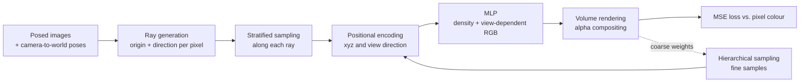

# NeRF 3D Reconstruction

A from-scratch PyTorch reimplementation of Neural Radiance Fields for novel view synthesis from posed images, written to study volumetric scene representations for 3-D perception.

> **Status: work in progress.** This is a reimplementation of NeRF (Mildenhall et al., ECCV 2020), not original research. The model, ray/volume-rendering code, trainer and config are in the repository, but the end-to-end pipeline does not currently run from a fresh clone; see [Known issues](#known-issues). No quantitative results or renders have been produced or committed yet.

## Pipeline



## What it does

Given a set of images with known camera poses, the code trains a network that maps a 3-D position and a viewing direction to a volume density and an RGB colour. Images from new camera poses are produced by integrating that field along each pixel's ray.

Why this matters for perception: because NeRF models density along every ray, the representation encodes what lies in front of what, so occlusion and visibility are handled by the rendering equation instead of being added as a separate heuristic. The rendering code also outputs an expected-depth value per ray.

## What is implemented here

All of the following is in this repository (file paths in parentheses):

- Sinusoidal positional encoding for positions (10 frequencies) and view directions (4 frequencies), with the raw input concatenated (`src/models/nerf.py`).
- NeRF MLP: 8 fully connected layers of width 256 with ReLU, an input skip connection, a non-negative density head, and a colour branch conditioned on the encoded view direction with a sigmoid output (`src/models/nerf.py`).
- Pinhole ray generation from image size, focal length and a 4x4 camera-to-world pose (`src/rendering/rays.py`).
- Stratified (jittered) sampling along rays and inverse-CDF hierarchical sampling from coarse-pass weights (`src/rendering/rays.py`).
- Discrete volume rendering returning RGB, expected depth and per-sample weights, with optional white background, plus chunked full-image rendering (`src/rendering/volume_renderer.py`).
- Training loop with a coarse and a fine network, random ray batches, Adam with exponential learning-rate decay, optional CUDA mixed precision, TensorBoard logging and checkpoint save/resume (`src/training/trainer.py`).
- Sum of coarse and fine MSE losses (`src/training/losses.py`).
- Dataclass-based YAML configuration (`src/config/config.py`, `configs/lego_config.yaml`).
- Training and rendering entry points, PSNR and a simplified SSIM, image and video helpers (`experiments/`, `src/utils/`).

## Method summary

- **Positional encoding.** Each coordinate is expanded to sin and cos at frequencies 2^0 ... 2^(L-1), so the MLP can represent high-frequency detail. L is 10 for position and 4 for direction. (Like the authors' reference implementation, frequencies are 2^k without the factor of pi shown in the paper's equation. This only rescales the input coordinates and does not change what the network can represent.)
- **Radiance field.** The MLP sees the encoded position and outputs density and a feature vector. Colour is predicted from that feature plus the encoded view direction, so density depends on position only and colour also depends on viewing direction.
- **Volume rendering.** Along a ray, each sample gets opacity alpha = 1 - exp(-density x spacing). Transmittance is the running product of (1 - alpha) over samples in front. Each sample's weight is transmittance x alpha, and the pixel colour is the weighted sum of sample colours. Expected depth uses the same weights.
- **Hierarchical sampling.** A coarse network renders 64 samples per ray; its weights define a distribution from which 128 extra samples are drawn. The fine network is evaluated on all samples sorted by distance.
- **Loss.** Mean squared error between rendered and ground-truth pixel colours for both the coarse and fine renders.

Default hyperparameters (from `configs/lego_config.yaml`): learning rate 5e-4 decaying by 0.1 over 250,000 steps, 1024 rays per step, one image per step, white background, mixed precision on.

## Quick start

These are the intended commands, taken from the entry-point code. They will not complete until the issues listed below are fixed.

```bash
python -m venv venv && source venv/bin/activate
pip install -r requirements.txt
pip install -e .
```

**Data.** The code expects the NeRF synthetic (Blender) dataset under `data/nerf_synthetic/<scene>/` with `transforms_train.json`, `transforms_test.json` and the image folders. Run `python scripts/download_data.py` to print download instructions (Nerfstudio's `ns-download-data blender`, or the original Google Drive folder) and to create the target directory. The script does not download anything itself.

**Train** (default scene lego, config path in `configs/lego_config.yaml`):

```bash
python experiments/train.py --config configs/lego_config.yaml            # add --device cpu if no GPU
python experiments/train.py --config configs/lego_config.yaml --resume outputs/checkpoints/checkpoint_step_10000.pth
tensorboard --logdir outputs/logs
```

**Render and evaluate** (writes PNGs to `outputs/renders`, prints mean PSNR over the rendered test views, optional 360-degree video):

```bash
python experiments/render.py --config configs/lego_config.yaml \
    --checkpoint outputs/checkpoints/<checkpoint>.pth --num_views 5 --render_360
```

**Tests:**

```bash
pip install pytest
pytest tests
```

## Project structure

```
configs/lego_config.yaml      Training configuration for the lego scene
experiments/train.py          Training entry point
experiments/render.py         Novel-view and 360-degree rendering, PSNR
scripts/download_data.py      Prints dataset download instructions
src/config/                   Dataclass config + YAML loader
src/models/nerf.py            Positional encoding and NeRF MLP
src/rendering/                Ray generation, sampling, volume renderer
src/training/                 Trainer and loss
src/utils/                    PSNR, simplified SSIM, optional LPIPS, image/video helpers
tests/test_nerf.py            Two unit tests (model forward, positional encoding)
notebooks/                    Data exploration, training analysis, visualization
```

## Results

Not yet reported. No trained checkpoint, PSNR/SSIM numbers, or rendered images are committed to this repository, and none are claimed here. Once the pipeline runs, the evaluation command above prints mean PSNR on the test views; results should be added to this section with the scene, number of training steps, and hardware.

Test status, run on CPU in a fresh Python 3.12 virtual environment with current PyTorch: **1 passed, 1 failed** (`tests/test_nerf.py`). `test_positional_encoding` passes; `test_nerf_forward` fails (see below).

## Known issues

Found while reading and running the code for this README; they are not fixed here because this change only touches documentation.

1. `NeRF.forward` reads `self.skip_connection_layer`, which `__init__` never stores, so any forward pass raises `AttributeError`. This is the cause of the failing test.
2. `src/training/trainer.py` imports `hierarchical_sample` from `src.rendering`, but `src/rendering/__init__.py` does not export it, so `import src.training` raises `ImportError`.
3. `experiments/train.py` and `experiments/render.py` import `NeRFDataset` from `src.data`, but no `src/data` package is in the repository. The `.gitignore` entry `data/` also matches `src/data/`, which is the likely reason it was never committed. The dataset loader therefore cannot be reviewed here.
4. `Trainer.validate()` is a stub that renders nothing and returns a PSNR of 0.
5. `compute_ssim` is a single-window global approximation, not the standard Gaussian-window SSIM, so its values are not comparable with published numbers.
6. `setup.py` still has placeholder author and URL fields.

## Limitations and next steps

- Fix the issues above, add the dataset loader, and add a test that runs one training step on synthetic rays.
- Implement real validation (full-image PSNR on held-out views) and standard SSIM and LPIPS.
- Train on the lego scene, then report PSNR/SSIM with the command above and commit a few renders.
- Evaluate speed-ups (hash-grid encodings, occupancy-based sampling).
- Extend to real captured scenes with estimated poses.

## Related work

[lunar-occlusion-tracking](https://github.com/sadeeqgandalf/lunar-occlusion-tracking): a separate project on tracking under occlusion.

## References

- B. Mildenhall, P. P. Srinivasan, M. Tancik, J. T. Barron, R. Ramamoorthi, R. Ng. *NeRF: Representing Scenes as Neural Radiance Fields for View Synthesis.* ECCV 2020. https://arxiv.org/abs/2003.08934
- NeRF synthetic (Blender) dataset, released with the paper above: https://drive.google.com/drive/folders/1cK3UDIJqKAAm7zyrxRYVFJ0BRMgrwhh4

`setup.py` declares the MIT licence, but no LICENSE file is present in the repository.
